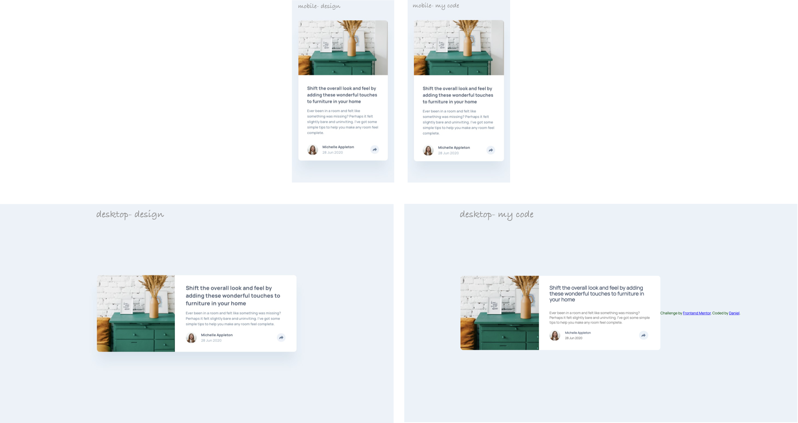

# Frontend Mentor - Article preview component solution

This is a solution to the [Article preview component challenge on Frontend Mentor](https://www.frontendmentor.io/challenges/article-preview-component-dYBN_pYFT). Frontend Mentor challenges help me improve my coding skills by building realistic projects.

## Table of contents

- [Overview](#overview)

  - [The challenge](#the-challenge)
  - [Screenshot](#screenshot)

  - [Links](#links)

- [My process](#my-process)
  - [Built with](#built-with)
  - [What I learned](#what-i-learned)
  - [Continued development](#continued-development)
- [Author](#author)

## Overview

### The challenge

Users should be able to:

- View the optimal layout for the component depending on their device's screen size
- See the social media share links when they click the share icon

### Screenshot

### Links

- Solution URL: [Add solution URL here](https://github.com/danM51/article-preview-component-master-Finale.git)
- Live Site URL: [Add live site URL here](https://danm51.github.io/article-preview-component-master-Finale/)

## My process

- analyse design/style-guide system,  
  -develop app in regards to the evaluation of the design using HTML Sass Css and a JS for active state functionality state

### Built with

- Semantic HTML5 markup
- SAsS
- CSS custom properties
- Flexbox
- Mobile-first workflow

### Continued development

i'd like to dive deeper into animation and overall learn tips and tricks via CSS and JS to create more dynamic responsive apps. Also establish a better naming convention for my classes and variables that can make it easy and clear for anyone but also easy for me to return to developing.

## Author

- Website - [Daniel](https://www.your-site.com)
- Frontend Mentor - [@danM51](https://www.frontendmentor.io/profile/danM51)
